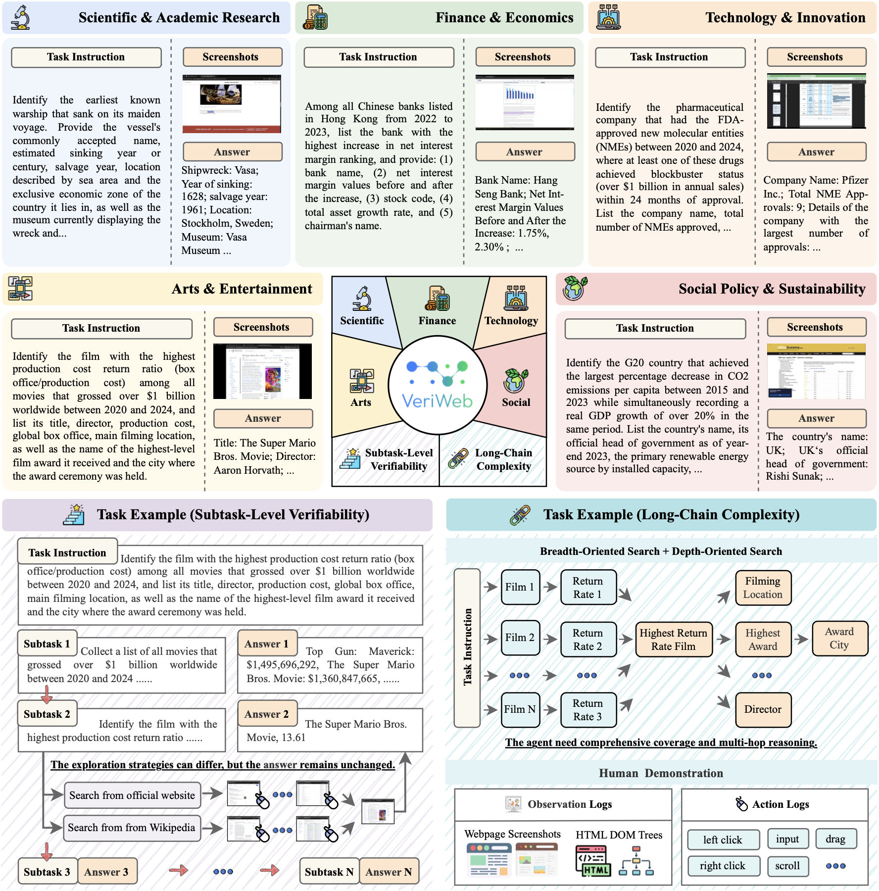

<h1 align="center">VeriWeb: Verifiable Long-Chain Web Benchmark for Agentic Information-Seeking</h1>

<div align="center">
<a href='https://arxiv.org/abs/2508.04026'></a> 
<a href='https://huggingface.co/datasets/2077AIDataFoundation/VeriGUI'></a>
<a href='LICENSE'></a>
</div>

> [!NOTE]
> This project was originally named VeriGUI. As our initial data collection focused on web-based tasks that primarily involve information-seeking rather than GUI interaction, we now define this part as the standalone VeriWeb benchmark, while desktop and other GUI-oriented scenarios will be released as a separate benchmark (in progress). We apologize for any resulting confusion.


## 🧭 Contents

- 🌟 [Updates](#-updates)
- 📖 [Overview](#-overview)
- ✨ [Key Features](#-key-features)
- 🚀 [Installation](#-installation)
- 🤖 [Running Agents](#-running-agents)
- 📊 [Evaluation](#-evaluation)
- 🗂️ [Project Structure](#-project-structure)
- 💻 [Visualize Tool](#-visualize-tool)
- 🎓 [Citation](#-citation)
- 📞 [Contact](#-contact)
- 👥 [Contributors](#-contributors)
- 📄 [License](#-license)


## 🌟 Updates

- `[Oct 23, 2025]` 🔥 We have released the updated 302 web-based task trajectories!
- `[Jul 21, 2025]` 🔥 We have released the first batch of 130 web-based task trajectories!

## 📖 Overview

Recent advances have showcased the extraordinary capabilities of Large Language Model (LLM) agents in tackling web-based information-seeking tasks. However, existing efforts mainly focus on **single-fact retrieval** and rely on **outcome-only verification**, thereby limiting their scalability in realistic knowledge-intensive scenarios that involve long-horizon web tasks requiring large-scale retrieval and synthesis of information from diverse sources.

In this work, we introduce VeriWeb, a novel verifiable long-chain web benchmark designed to facilitate the evaluation and development of web agents within realistic web environments. Our benchmark emphasizes two critical dimensions: 

- (1) **🔗 Long-chain complexity**, encompassing both breadth- and depth-oriented search tasks to assess how effectively web agents ensure comprehensive information coverage and  consistent context tracking in multi-hop reasoning;
- (2) **✅ subtask-level verifiability**, where tasks are decomposed into a sequence of interdependent verifiable subtasks. This structure enables diverse exploration strategies within each subtask, while ensuring that each subtask-level answer remains unchanged and verifiable.

The benchmark consists of 302 tasks across five real-world domains, each with a complete trajectory demonstration, **annotated by human experts**. Extensive experiments on VeriWeb using various agents powered by different foundation models reveal significant performance gaps in handling long-horizon web tasks, highlighting the need for more powerful agentic information-seeking capabilities

<div align="center">
  
  <p><em>An overview of the VeriWeb benchmark across five domain-specific scenarios.</em></p>
</div>

## ✨ Key Features


### 🔗 Long-Chain Complexity

- 302 realistic information-seeking tasks across 5 real-world domains
- Long-chain web trajectories decomposed into multiple interdependent subtasks
- Tasks combine breadth-oriented search and depth-oriented search
- Agents must retrieve, track, and synthesize evidence from diverse web pages while maintaining consistent cross-page context

### ✅ Subtask-Level Verifiability

- Fine-grained evaluation at each intermediate subtask, not only the final outcome
- Fixed, verifiable target outputs for every subtask while supporting diverse exploration strategies
- Each subtask can serve as an independent starting point, enabling evaluation at different stages of a task
- Rich supervision signals for diagnosing failure modes and improving long-horizon planning, retrieval, and synthesis

### 🧑‍🎨 Human-Expert Annotation

- All tasks and trajectories carefully created and annotated by human experts
- High-quality task instructions, subtask decompositions, and answer annotations
- Each task includes a complete human demonstration with detailed observation and action logs in realistic web environments


## 🚀 Installation

```bash
# Only for evaluating
pip install openai tqdm

# Run agents
pip install openai tqdm camel-ai[all] browser-use
```

## 🤖 Running Agents

We provide some examples of agents under the `agents` directory. You can run these agents by executing the following command:

```shell
python agents/some_agent.py
```

## 📊 Evaluation

The dataset of VeriWeb is located at [data](data). The format of the dataset is described in detail in the following sections.

```json
[
  {
    "id": "1",              // index id
    "name": "V1_3",         // name of the task
    "type": "global",       // type of the task, global or causal
    "instruction": "xxxxx", // instruction for the task
    "answer": "xxxxx",      // expected answer for the task, in JSON format
  },
  ......
]
```

The evaluation script `evaluate.py` can be used to evaluate the performance of agents using LLM-as-a-judge. The evaluation script expects a JSON format file with the following format:

```json
[
  {
    "id": "1",              // index id
    "name": "V1_3",         // name of the task
    "type": "global",       // type of the task, global or causal
    "instruction": "xxxxx", // instruction for the task
    "answer": "xxxxx",      // expected answer for the task, in JSON format
    "prediction": "xxxxx",  // agent's predicted result
    "nsteps": 10,           // number of steps taken by the agent
  },
  ......
]
```

With this file, you can run the evaluation script to get the performance of the agent:

```shell
python evaluate.py --input_file veriWeb_prediction.json --output_file output.json
```

Then, you can use `calc_avg.py` to calculate the average score of the evaluation results:

```shell
python calc_avg.py --input_file output.json
```

## 🗂️ Project Structure

The directory structure of the project is defined as follows:

```
agent-workflow-devkit/
├── agents/                 # Agent implementations
│   └── deepresearch.py     # Deepresearch agent example
│   └── search.py           # Search engine agent example
│   └── browseruse.py       # Browser-use agent example
│   └── owl.py              # Multi-agent system example
├── data/                   # Dataset files
│   └── data.json           # Cleaned data
│   └── original.json       # Original data
├── evaluated/              # Evaluation results
├── predictions/            # Model predictions
├── evaluate.py             # Evaluation script
├── batch_evaluate.py       # Batch evaluation
├── calc_avg.py             # Calculate averages
└── utils.py                # Utility functions
```

## 💻 Visualize Tool

### Usage
- Open [VeriGUI.2077ai.org](https://VeriGUI.2077ai.org)
- Select the corresponding task data folder
- View the visualization results

### Features
- Interactive event timeline visualization
- Support for various event types (MOUSE_DRAG, MOUSE_UP, TAB_CHANGE, etc.)
- Video playback synchronization
- Jump to specific actions functionality


## 🎓 Citation

If you find VeriWeb useful in your research, please cite our paper:

```bibtex
@article{verigui2025,
  title={VeriGUI: Verifiable Long-Chain GUI Dataset},
  author={Shunyu Liu, Minghao Liu, Huichi Zhou, Zhenyu Cui, Yang Zhou, Yuhao Zhou, Wendong Fan, Ge Zhang, Jiajun Shi, Weihao Xuan, Jiaxing Huang, Shuang Luo, Fang Wu, Heli Qi, Qingcheng Zeng, Ziqi Ren, Jialiang Gao, Jindi Lv, Junjie Wang, Aosong Feng, Heng Zhou, Wangchunshu Zhou, Zhenfei Yin, Wenlong Zhang, Guohao Li, Wenhao Yu, Irene Li, Lei Ma, Lei Bai, Qunshu Lin, Mingli Song, Dacheng Tao},
  journal={arXiv preprint arXiv:2508.04026},
  year={2025}
}
```

## 📞 Contact

For questions, suggestions, or collaborations, please feel free to:

- 🐛 Issues: [GitHub Issues](https://github.com/VeriTeam/VeriWeb/issues)

## 👥 Contributors

We thank all contributors who have helped make VeriWeb possible. Special thanks to the research team and community members who provided valuable feedback and improvements.


## 📄 License

This project is licensed under the Apache 2.0 License.

